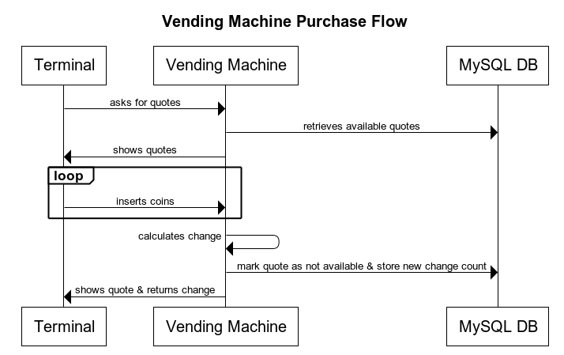
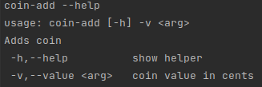
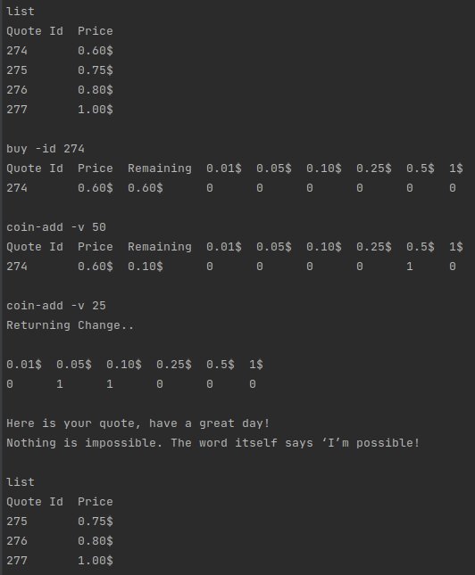
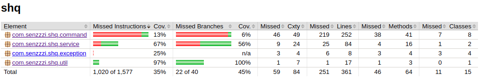

# Shq Challenge

This folder contains the source code and all the necessary packaging to run the vending machine.

- [Description, Considerations and Features](#description-considerations-and-features)
- [Purchase Flow and Overall Architecture](#purchase-flow-and-overall-architecture)
- [Test, Run and Deploy](#test-run-and-deploy)
- [Commands](#commands)
- [Future Work and Improvements](#future-work-and-improvements)
- [Frameworks/Libraries/Tools](#frameworkslibrariestools)

## Description, Considerations and Features

This repo contains the code to run a command line interactive vending machine. The purpose of the machine is to sell inspirational quotes.

The machine performs as follows:

1. Once an item is selected and the appropriate amount of money is inserted, the machine returns the correct product.
2. It returns change if too much money is provided and asks for more money if insufficient funds have been inserted.
3. The machine takes an initial load of products and change. The change will be in denominations of 1¢, 5¢, 10¢, 25¢, 50¢, $1.
4. There's the possibility of reloading more quotes.
5. The machine keeps track of the available quotes to buy and how many change it has.
6. The change algorithm aim is to return the customer the least amount of coins.
7. It is possible to change the target quote after inserting some coins. If there are already enough money for the new product, it is returned, otherwise, the machine asks for more money.

## Purchase Flow and Overall Architecture

To interact with the machine, commands should be issue in the terminal.

All the quotes and the number of coins are stored in a MySQL Database. I assumed that it would be good to have this data stored "remotely".

The purchase flow looks as follows:

## Commands

To interact with the machine, commands should be issue in the terminal.

The available commands are:

Command | Description
--- | --- 
list | Lists Available Quotes To Buy
buy | Choose which quote to buy
coin-add | Adds coin
cancel | Cancels any current purchase
help | Shows available commands
exit | Shut Down Vending Machine
restore | Restores initial data (both quotes and coins)
quote-add | Insert a new quote - only for maintenance purposes

Each command will show its arguments using "-h" or "--help", e.g.:

Here is an example of a quote purchase that retrieves change:

## Test, Run and Deploy

To compile, test, package and create a docker image for the vending machine, a Dockerfile with a multi-stage build is provided.

`docker build -t vending-machine .`

Coverage for the vending machine is around 40% which is not good enough.

To run the application, there's a `compose.yaml` file that when used, will create 2 containers:
* Vending Machine container
* MySQL container

To launch the application run the following command:

`docker-compose -f compose.yaml up -d && docker attach shq-challenge_vending-machine_1`

This command will attach your terminal to the one in the vending machine container so that commands can be read properly. 

| WARNING: If you built a docker image whose name is not `vending-machine`, then you need to go to the `compose.yaml` file and change the name to the one you chose |
| --- |

The MySQL container will run in background.

## Future Work and Improvements
Although the vending machine works as is, there are many possible improvements:
* **Increase test coverage with proper testing of remaining commands**
* Improve documentation
* Improve terminal output
* Add logic when there are not enough coins for the change (not implemented yet)
* Add possibility of adding more coins (maintenance purposes)
* Replace the change algorithm to one a bit better that if there are no more of the greater coins, the change is not given back as N 0.01$ coins

# Frameworks/Libraries/Tools
The following external frameworks, libraries and tools were used:
* [Spring Boot](https://spring.io/projects/spring-boot)
* [Picocli](https://github.com/remkop/picocli)
* [Docker](https://www.docker.com/)
* [MySql](https://www.mysql.com/)